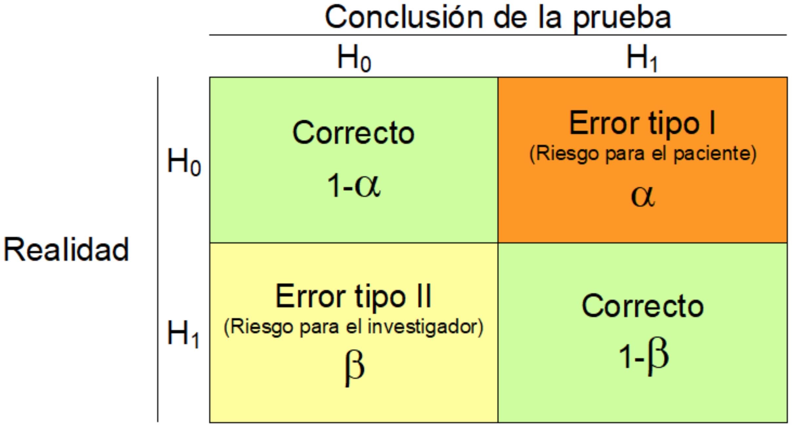
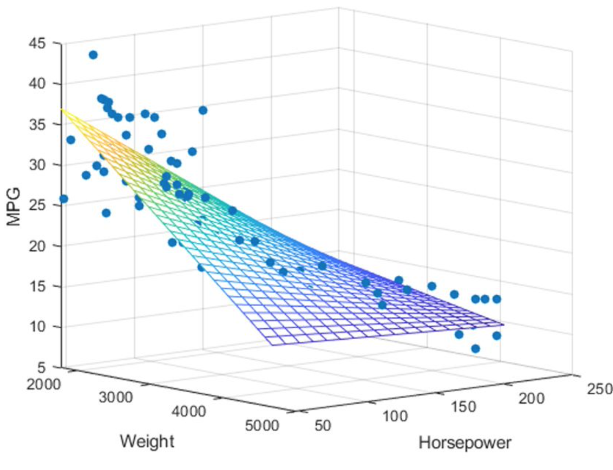
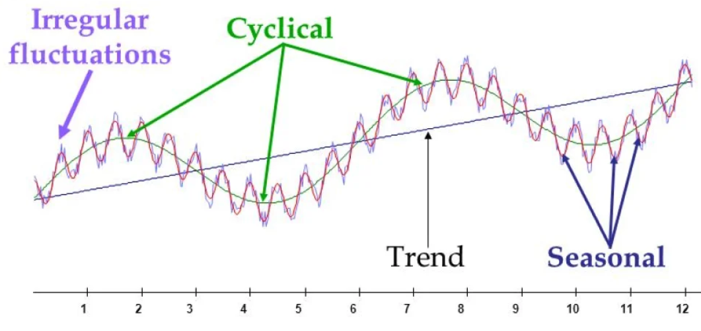
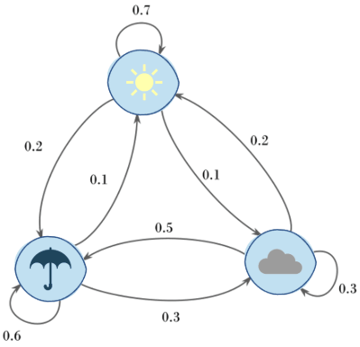
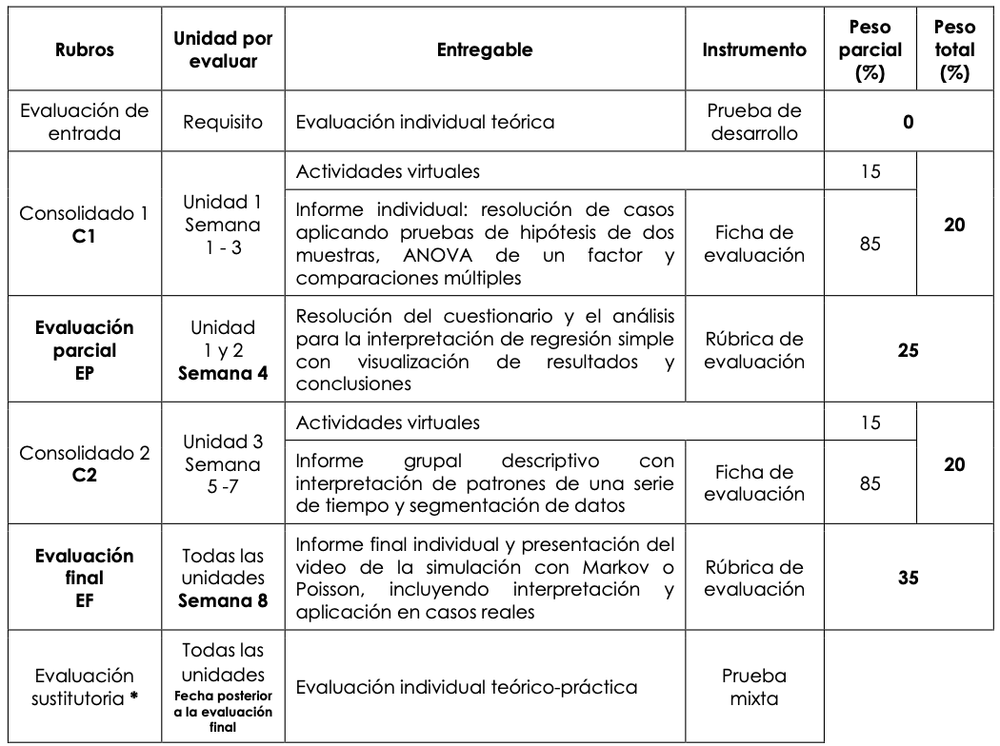
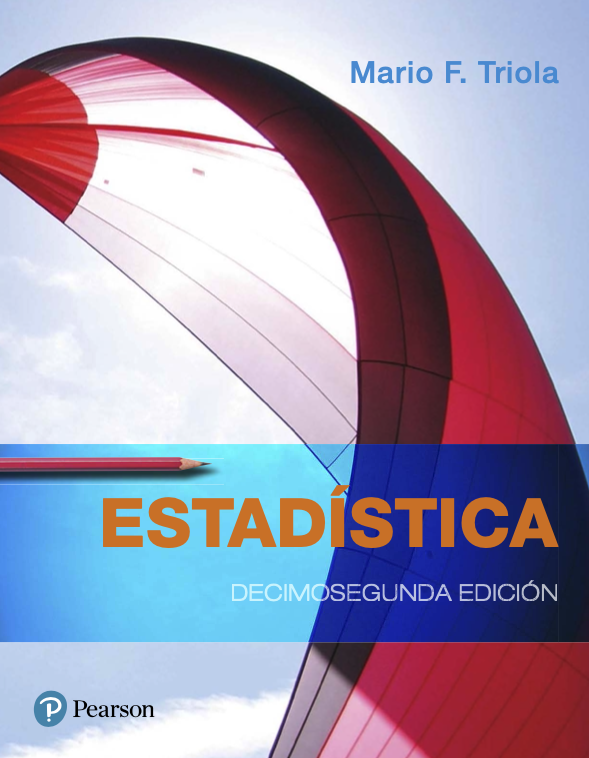
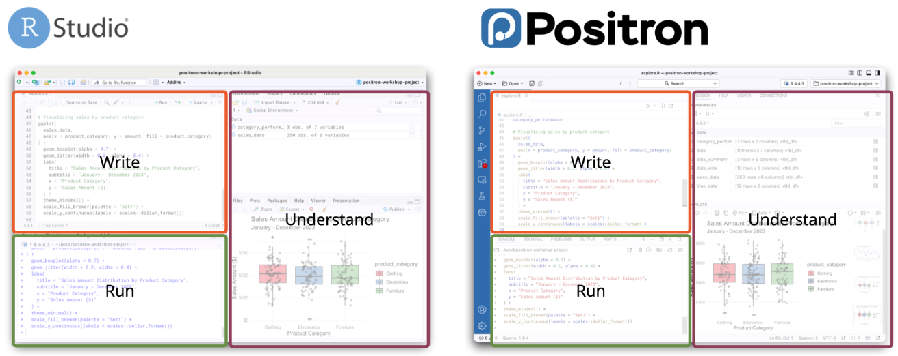

#              CONTENIDO {.center}

## UNIDAD 1 {.center}

-   [Pruebas de Hipótesis y Diseño de Experimentos]{style="color:green;"}

    1.  Pruebas de hipótesis para un parámetro ($\pi, \mu, \sigma^2$)
    2.  Pruebas de hipótesis para dos parámetros ($\pi_1-\pi_2, \mu_1-\mu_2, \sigma^2_1/\sigma^2_2$)
    3.  ANOVA
    4.  Comparaciones multiples

::: r-stack
{.r-stretch .fragment .absolute top="300" left="550" width="650" height="350"}
:::

## UNIDAD 2 {.center}

-   [Regresión y Correlación Lineal Simple y Múltiple]{style="color:green;"}

    1.  Regresión y correlación lineal simple
    2.  PH - IC para los parámetros del modelo simple
    3.  Regresión y correlación lineal múltiple
    4.  PH - IC para los parámetros del modelo múltiple

::: r-stack
{.r-stretch .fragment .absolute top="150" left="880" width="400" height="350"}
:::

## UNIDAD 3 {.center}

-   [Series de Tiempo y Clasificación]{style="color:green;"}

    1.  Componentes de una serie de tiempo
    2.  Modelos autorregresivos y de medias móviles
    3.  Clasificación supervisada:
    
        - Regresión logística
        
    4.  Clasificación no supervisada:
    
        - k-means

::: r-stack
{.r-stretch .fragment .absolute top="350" left="650" width="500" height="250"}
:::

## UNIDAD 4 {.center}

-   [Modelos y Procesos Estocásticos]{style="color:green;"}

    1.  Cadenas de Markov en tiempo discreto
    2.  Aplicaciones: Clima, PageRank
    3.  Proceso de Poisson de tiempo continuo
    4.  Aplicación: tiempos de espera en una cola

::: r-stack
{.r-stretch .fragment .absolute top="150" left="800" width="400" height="400"}
:::

## EVALUACION {.center}

::: r-stack
{.r-stretch .fragment .absolute top="70" left="200" width="750" height="600"}
:::

## BIBLIOGRAFIA {.center}

::: r-stack
{.r-stretch .fragment .absolute top="70" left="300" width="500" height="600"}
:::

## SOFTWARE {.center}

::: r-stack
{.r-stretch .fragment .absolute top="70" left="100" width="800" height="400"}
:::

## IDE {.center}

::: r-stack
{.r-stretch .fragment .absolute top="70" left="50" width="1000" height="500"}
:::

## PREGUNTAS... {.center}
::: r-stack
{.r-stretch .fragment .absolute top="70" left="0" width="1000" height="600"}
:::

